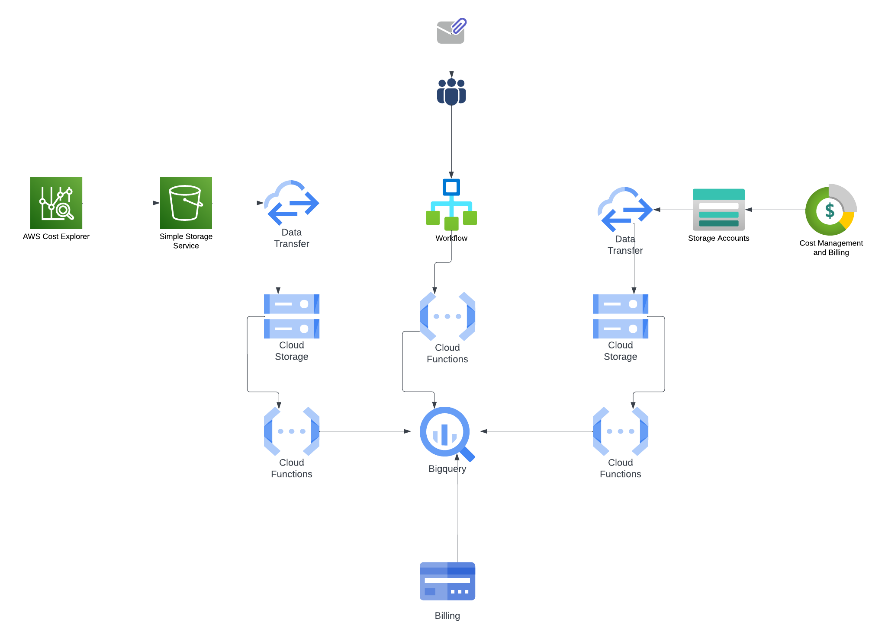

## About ##
The Cloud Elevation Index metric was developed at Penn State University to show the relative usage of higher level cloud services across accounts and in larger groupings. The Index value tracks the spend of services against a relative score for services in the big three providers. For a more informative explanation see the presentation Rick Rhoades delivered at the 2024 Internet2 Cloud Forum.

[Telling Our Story: The Somewhat Painful, Probably Never-Ending Search for Cloud Metrics](https://drive.google.com/file/d/19nPqr4m0cxjSRZbBE-f4FiY1yiPmBLOq/view?usp=sharing)

## Loading CEI Scores into BigQuery ##

Note that the schema has more fields than are currently used. These are for future use.  

`bq load Cloud_Elevation_Index.CEI_SKU_Scoring --schema schema.json --clustering_fields provider,service_name cei_scores.nljson`

## Creating a new Score ##
When an unseen service shows up in billing data that service will not be counted until a service score is assigned. To simplify this operation, we generated an AI prompt to evaluate services based on a rubric. The default prompt is included [here](default_prompt.json). It is formatted for a curl request to Vertex AI and a Gemini multi-modal model. The text can be extracted to be used against other models if desired, however results may vary significantly. 

## Creating BQ Views ##
Each provider has at minimum two views towards generating a CEI value. The first view creates an intermediate that creates a spend by service in each billing period by account joined to the service score table. This was done to make it easy to troubleshoot issues in queries. The CEI view then creates the final scores. Each service scoring view definition will need to be edited to point to the appropriate spend data.

### AWS ###
AWS relies on a third intermediate that simplifies the raw CUR data for CEI. This is the one to edit to point to billing data.

```bq mk --view `cat ./views/AWS_CUR_Cost_By_Service` Cloud_Elevation_Index.AWS_CUR_Cost_By_Service```

The AWS Service Scoring view may require editing to use the service_alias field during the score table join if not using CUR data. This is likely if using data from a third party cost management service.  
```bq mk --view `cat ./views/AWS_Service_Scoring` Cloud_Elevation_Index.AWS_Service_Scoring```

```bq mk --view `cat ./views/AWS_CEI` Cloud_Elevation_Index.AWS_CEI```

### GCP ###
```bq mk --view `cat ./views/GCP_Service_Scoring` Cloud_Elevation_Index.GCP_Service_Scoring```

```bq mk --view `cat ./views/GCP_CEI` Cloud_Elevation_Index.GCP_CEI```

### Azure ###
```bq mk --view `cat ./views/Azure_Service_Scoring` Cloud_Elevation_Index.Azure_Service_Scoring```

```bq mk --view `cat ./views/Azure_CEI` Cloud_Elevation_Index.Azure_CEI```

## Billing Data Collection ## 
This section added for reference. Future versions should build on the FinOps Foundation's [FOCUS specification](https://focus.finops.org) as providers adopt commonality of data format. 

Schema formats of existing data storage have been provided to give an understanding of data format if SQL statements need to be modified.  While the scripts to migrate data have not been provided here, we have tried to remain a true to the original providers format as possible. This diagram is provided to show a basic flow of how data from AWS, Azure, and Google can be collected into BigQuery tables. Similar workflows can be constructed to move data to other providers and large scale databases. 

