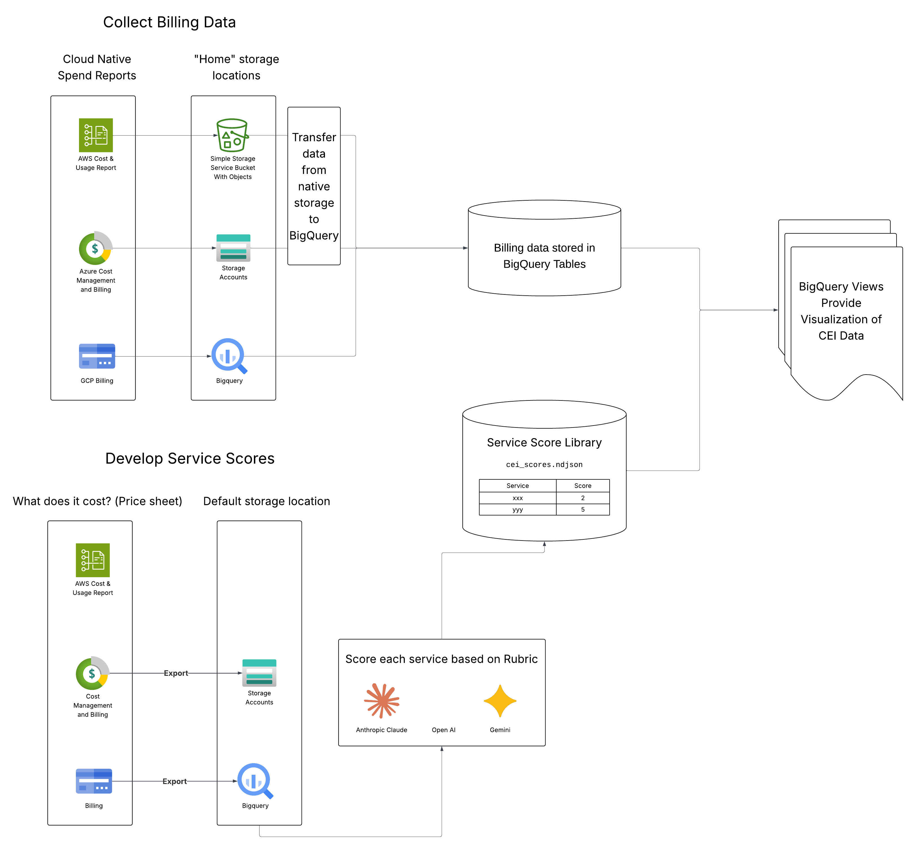
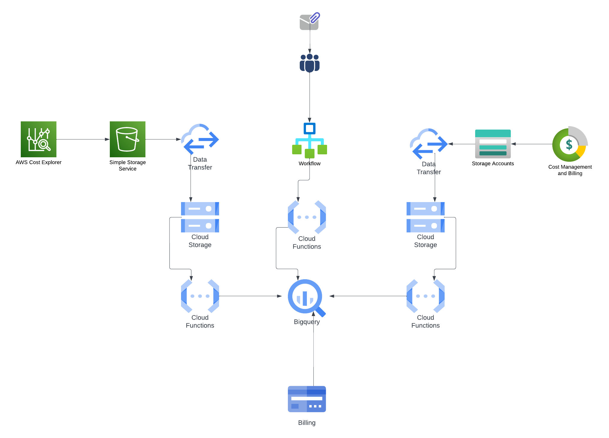

## About CEI

If you are not familiar with CEI, start with the explanation of what it is and where it comes from on the [Cloud Elevation Index wiki](https://spaces.at.internet2.edu/x/roD4Fg).

When you are ready to start implementing CEI for your institution, this github repo is the place to start.

## How It Works

The current implementations of CEI make use of BigQuery in Google Cloud. Conceptually, it could be implemented in any SQL-compliant database system, but all current examples use BigQuery. There are two sets of data required to generate CEI scores:

* A set of CEI service scores. A sample set is provided in this github repo, or a new set could be generated. These get loaded into a BigQuery table.  
* A collection of cloud billing data. This also needs to be loaded into BigQuery. The process of importing data from AWS or Azure will need to be documented. GCP billing data can natively be fed to BigQuery

Once the data is available, a set of BigQuery views is configured to do the calculations and display the results.

## What is in this repo

This repo contains:

* Sample schemas for AWS and Azure billing data (GCP billing data can natively be stored in BigQuery), as well as generic FOCUS data. (schemas folder)  
* Sample BiqQuery views for analyzing GCP, AWS, Azure, and FOCUS data. (views folder)  
* A set of service scores you can use to generate CEI reports for your billing data (cei\_scores.json)  
* An example prompt for generating new CEI scores. (default\_prompt.json)
* Implementation guides for standing up CEI end-to-end. (docs folder)

## Documentation

Step-by-step implementation guides live in the [docs folder](docs/). Read in order:

1. **[Billing Data Export Guide](docs/billing-export.md)** — Get AWS, Azure, and GCP billing data flowing into BigQuery.
2. **[BigQuery Views Guide](docs/bigquery-views.md)** — Create the views that turn billing data into CEI scores, with troubleshooting.

## Creating a new Score

When an unseen service shows up in billing data that service will not be counted until a service score is assigned. To simplify this operation, we generated an AI prompt to evaluate services based on a rubric. The default prompt is included [here](default_prompt.json). It is formatted for a curl request to Vertex AI and a Gemini multi-modal model. The text can be extracted to be used against other models if desired, however results may vary significantly.

## Billing Data Collection

This section added for reference. Future versions should build on the FinOps Foundation's [FOCUS specification](https://focus.finops.org) as providers adopt commonality of data format.

Schema formats of existing data storage have been provided to give an understanding of data format if SQL statements need to be modified. While the scripts to migrate data have not been provided here, we have tried to remain a true to the original providers format as possible. This diagram is provided to show a basic flow of how data from AWS, Azure, and Google can be collected into BigQuery tables. Similar workflows can be constructed to move data to other providers and large scale databases.

